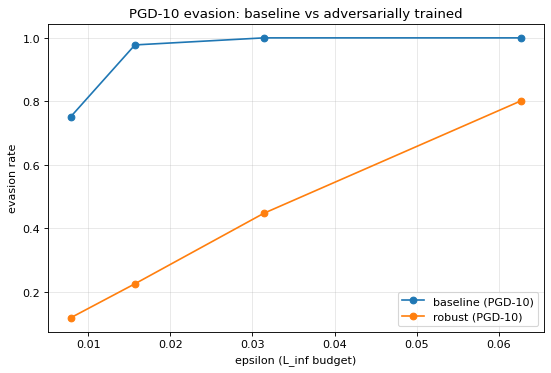

# Adversarial ML Attack Lab

Hands-on implementation of three classic **adversarial attacks** (**FGSM**, **PGD**, **DeepFool**) against a CNN trained on CIFAR-10, with a comparison of evasion rates and a defence based on **adversarial training**.

> Educational project. CPU-only — no GPU required. Designed to be reproducible end-to-end on a laptop in under one hour.

## TL;DR

A neural network that achieves **72 % accuracy** on clean CIFAR-10 images can be brought down to **0 % accuracy** by adding a perturbation so small the human eye cannot see it (~3 % of the pixel range). This project reproduces that result with three different attacks, then trains a more robust model that recovers **33 %** accuracy under the same attack.

## What is an adversarial attack?

Modern image classifiers (CNNs) are extremely accurate on clean data, but surprisingly fragile: by tweaking the pixel values of an image by a tiny amount — typically less than what a JPEG compression already changes — an attacker can flip the model's prediction from "cat" to "truck" while the image still *visually* looks like a cat.

These tiny tweaks are called **adversarial perturbations**, and the modified images are called **adversarial examples**.

```
   original image          +       imperceptible noise        =       adversarial image
   model predicts: cat                                                model predicts: truck
```

**Why it matters for cybersecurity & AI safety:**

- A spam classifier that can be tricked by adding invisible characters to an email.
- A face-recognition system that can be fooled by glasses with a specific pattern.
- A self-driving car's stop-sign detector that can be tricked by stickers.
- A malware classifier that can be bypassed by adding a few "junk" bytes to a file.

Understanding *how easy* these attacks are — and how much it costs to defend against them — is foundational for anyone working at the intersection of ML and security.

## What's in this lab

- A small CNN trained from scratch on CIFAR-10 (10 image classes: airplane, cat, dog, ship, …)
- Three classic attacks, implemented from scratch in PyTorch (no `cleverhans`, no `foolbox`)
- Quantitative evaluation: how often does each attack succeed, and how much perturbation does it need?
- One defence: **adversarial training** — retraining the model on adversarial examples — and a measurement of the **accuracy ↔ robustness trade-off** it implies.

## Project structure

```
.
├── adversarial_ml_lab.ipynb     ← self-contained notebook: model, attacks, defence, plots
├── evasion_comparison.png       ← key result figure (referenced below)
├── requirements.txt
├── .gitignore
└── README.md
```

All Python code (the CNN, FGSM / PGD / DeepFool, PGD adversarial training, evasion metrics, plotting helpers) is defined directly in the notebook — no external modules to import. When you run it, it will:

- create `data/` next to itself and download CIFAR-10 there on first run (~170 MB),
- save trained model weights (`baseline.pt`, `robust.pt`) and a results JSON next to itself.

These generated files are listed in `.gitignore`.

## The three attacks, in plain words

All three attacks share the same idea: use the model's own gradients (the same machinery that trains it) to figure out, for a given input, which pixels to nudge — and in which direction — to push the prediction toward a wrong class. They differ in *how* they nudge.

| Attack       | Plain-words description                                                            | Bound | Steps | Reference                        |
|--------------|------------------------------------------------------------------------------------|:-----:|:-----:|----------------------------------|
| **FGSM**     | One quick step in the direction that hurts the model most. Fast, crude.            |  L∞   |   1   | Goodfellow et al., 2014          |
| **PGD**      | Repeat FGSM many times with small steps, the gold-standard L∞ attack.              |  L∞   |  10   | Madry et al., 2017               |
| **DeepFool** | Search for the *smallest* perturbation that crosses the nearest decision boundary. |  L2   | iter. | Moosavi-Dezfooli et al., 2016    |

**Defence implemented: PGD adversarial training** (Madry et al., 2017) — instead of training the model on clean images only, we generate PGD adversarial examples *during* training and train on those. The model learns to classify correctly *even when the input has been perturbed*.

## Metrics, explained

We measure four things on the test set:

- **Clean accuracy** — how often the model is correct on normal, unperturbed images. *Baseline performance*.
- **Adversarial accuracy** — how often the model is correct *after* the attack has perturbed the image. *Lower = the attack worked*.
- **Evasion rate** — the headline number. Of the images the model originally classified *correctly*, what fraction did the attack manage to flip to a wrong class? *Higher = the attack worked*.
- **Mean L∞ / L2 norm of the perturbation** — *how much* the attacker had to change the image. Lower = stealthier.

About **ε (epsilon)**: this is the attacker's *budget* — the maximum allowed change per pixel, expressed as a fraction of the pixel range. With pixels in `[0, 1]`, an ε of `8/255 ≈ 0.031` means each pixel is allowed to move by at most ~3 % of the colour scale. This is the standard "imperceptible" budget on CIFAR-10.

## Quickstart

```bash
# 1. Install dependencies
python -m pip install -r requirements.txt

# 2. Launch the notebook
jupyter notebook adversarial_ml_lab.ipynb
```

Then run the cells in order. The notebook:

1. Loads CIFAR-10 (auto-downloaded on first run)
2. Trains the baseline CNN (~5 min on a modern CPU, 8 epochs, ~70–75 % test accuracy)
3. Runs FGSM, PGD, DeepFool and reports per-attack metrics
4. Plots evasion rate vs `epsilon`
5. Re-trains the model adversarially and re-evaluates robustness

Total runtime on CPU: **~25–35 min** end-to-end.

## What the notebook produces

- A learning-curve plot for the baseline CNN
- A per-attack metrics table (clean acc, adv acc, evasion, L∞, L2)
- An evasion-rate-vs-`epsilon` comparison plot (FGSM vs PGD-10, with DeepFool marker)
- Side-by-side images: clean / adversarial / amplified perturbation — visual proof that the changes are imperceptible
- A baseline-vs-adversarially-trained robustness comparison

## Measured results

Numbers from a full run on CPU (seed 42, baseline 8 epochs, adversarial training 12 epochs warm-started from the baseline).

### Baseline CNN — clean accuracy

| Epoch | Train acc | Test acc        |
|------:|----------:|----------------:|
| 1     | 49.6 %    | 60.2 %          |
| 4     | 71.2 %    | 68.9 %          |
| 7     | 77.7 %    | **75.6 %** (peak) |
| 8     | 79.1 %    | 72.4 %          |

Final baseline test accuracy: **72.4 %**.

### Attacks on the undefended baseline

Evaluated on ~2 560 test samples (`max_batches=10`). Evasion rate is computed over the subset that the model originally classified correctly.

| Attack    | ε        | Adv accuracy | Evasion rate | Mean L∞ |
|-----------|----------|-------------:|-------------:|--------:|
| FGSM      | 2/255    | 27.9 %       | 61.3 %       | 0.0078  |
| FGSM      | 4/255    | 11.0 %       | 84.8 %       | 0.0157  |
| FGSM      | **8/255**| 2.4 %        | **96.6 %**   | 0.0314  |
| FGSM      | 16/255   | 1.1 %        | 98.5 %       | 0.0627  |
| PGD-10    | 2/255    | 18.2 %       | 74.8 %       | 0.0078  |
| PGD-10    | 4/255    | 1.6 %        | 97.7 %       | 0.0157  |
| PGD-10    | **8/255**| **0.0 %**    | **100.0 %**  | 0.0314  |
| PGD-10    | 16/255   | 0.0 %        | 100.0 %      | 0.0627  |
| DeepFool  | —        | 5.5 %        | **91.8 %**   | 0.0267 (mean L2 = 0.264) |

**How to read this:**

- **PGD-10 beats FGSM at every budget.** The intuition is simple — one big step (FGSM) overshoots; ten smaller steps (PGD) follow the curvature of the loss surface and find a better perturbation. At a tiny budget of ε = 2/255, PGD already evades **75 %** of the time vs **61 %** for FGSM.
- **At the standard CIFAR-10 budget of ε = 8/255, PGD-10 brings the model to 0 % accuracy.** Not "low accuracy" — *zero*. Every single image the model used to classify correctly is now misclassified, while the perturbation stays under 3 % of the pixel range.
- **DeepFool fools the model 92 % of the time with an L∞ smaller than 8/255.** It is designed to find the *smallest* perturbation, not the most damaging one for a given budget — so it's the relevant metric when the goal is *stealth* rather than *brute success*.

### Defence — PGD adversarial training (12 epochs)

PGD-10 evaluation, baseline vs adversarially-trained model:

| ε         | Baseline adv_acc | Robust adv_acc | Δ           |
|-----------|------------------:|---------------:|------------:|
| 2/255     | 18.0 %           | **52.6 %**     | **+34.6**   |
| 4/255     | 1.6 %            | 46.2 %         | +44.6       |
| **8/255** | **0.0 %**        | **33.0 %**     | **+33.0**   |
| 16/255    | 0.0 %            | 11.8 %         | +11.8       |

**How to read this:** under the standard PGD-8/255 attack, the undefended model is at **0 %** and the adversarially-trained one is at **33 %**. That's a +33-point absolute gain — but it comes at a price.

**The trade-off:** clean accuracy of the robust model is **59.6 %** (vs 72.4 % for the baseline) — *robustness costs roughly 13 points of clean accuracy*. This is the central practical lesson of the field: there is no free lunch — you cannot get robustness without giving up some clean performance, and you cannot defend against budgets larger than the one you trained on (here, the defence collapses to 12 % at ε = 16/255 because it was trained at ε = 8/255).



## Implementation notes

- All images are kept in the `[0, 1]` range with no per-channel normalisation, so `epsilon` values are directly interpretable as fractions of the pixel range.
- `BatchNorm` is set to `eval` mode during attack crafting, to avoid statistics leakage between samples in a batch (a subtle but documented pitfall).
- The DeepFool implementation iterates per-sample and is significantly slower than FGSM / PGD — the notebook evaluates it on a single batch of 128 samples for tractability on CPU.

## References

- Goodfellow, Shlens, Szegedy. *Explaining and Harnessing Adversarial Examples.* ICLR 2015. [arXiv:1412.6572](https://arxiv.org/abs/1412.6572)
- Madry, Makelov, Schmidt, Tsipras, Vladu. *Towards Deep Learning Models Resistant to Adversarial Attacks.* ICLR 2018. [arXiv:1706.06083](https://arxiv.org/abs/1706.06083)
- Moosavi-Dezfooli, Fawzi, Frossard. *DeepFool: a simple and accurate method to fool deep neural networks.* CVPR 2016. [arXiv:1511.04599](https://arxiv.org/abs/1511.04599)
